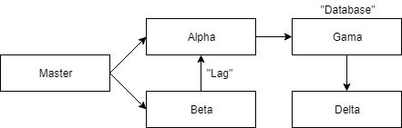

# Introduction
This is a starting point for blog post at [link]. Finished project is available on branch _finished_. It is designed purely for purposes of demonstrating OpenTracing, which is why the only thing these microservices do is communicate with each other using HTTP requests. It is also beginner friendly due to the code being really simple.

# Structure
Project consists of 5 microservices:
1. __master__ - This is the entry point of the application. It is served on `http://localhost:8080` (actual endpoint on `v1/master`). When queried, it makes two requests: to _alpha_ endpoint  `v1/alpha` and to _beta_ endpoint `v1/beta`.
2. __alpha__ - This is the first of 4 "slave" microservices. It is served on `http://localhost:8081` and has two endpoints: `/v1/alpha` (just returns value) and `/v1/alpha/beta`, which queries _gamma_ endpoint `v1/gamma`.
3. __beta__ - This is the second of 4 "slave" microservices. It is served on `http://localhost:8082` and has one endpoint: `/v1/beta`, which queries _alpha_ endpoint `/v1/alpha/beta`. Simulated lag is added to this request (random delay).
4. __gamma__ - This is the third of 4 "slave" microservices. It is served on `http://localhost:8083` and has one endpoint: `/v1/gamma`, which queries _delta_ endpoint `/v1/delta`. This microservice is different, because it uses a simulated database with CDI.
5. __delta__ - This is the last of 4 "slave" microservices. It is served on `http://localhost:8084` and has one endpoint: `/v1/delta`, which just return a value.

# Running the project
You can run precompiled binaries in folder _compiled_. Otherwise you can compile the microservices yourself. Each microservice is located in it's subfolder.

## Note
Due to simplicity of code, all urls are hardcoded to localhost. If you want to change the url to something else, you need to edit all the microservices and recompile them.