# Tracing KumuluzEE microservices with Jaeger

## Introduction
When it comes to developing applications within the microservice architecture, the number of microservices can grow quickly. Managing microservices becomes harder with each new or updated microservice. When an application experiences a slowdown and its »data flow« goes through several different microservices, pinpointing the exact location of a slowdown may be difficult for a developer. 

Before starting with actual code and guide, let us start with a brief explanation of what tracing is. Told bluntly, tracing is a way to track a request from its starting point through the entire network of microservices. In a typical Java microservice application, the »chain« starts either with frontend or API making a REST request to some entry microservice. That microservice then handles the request (usually with JAX-RS) and queries other microservices, databases or external applications. As we can see, the number of requests inside the network increases and spreads out throughout multiple different destinations (especially in large applications). This is all good and fine, but when a problem occurs, a developer must go through a lot of logs (produced by selected logging framework, such as Fluentd or Logstash – in KumuluzEE you can use the KumuluzEE Logs extension to simplify logging) to find the problem. If a problem is severe (such as a complete crash), a solution is usually discovered quickly or even handled automatically by some container orchestration tool (such as Kubernetes). Tougher problems are the slowdowns in which the application still works but in a limited capacity. 

This is where the tracing comes in. When implemented across the entire application, entire request flows are saved and presented to the user in an easy to use graphical interface. The base unit is called a span. A span can be an incoming or outgoing request; execution of a Java method; access to the database, etc. Each span contains basic information such as name and timestamps (additional data can be added within the code). Spans are related to each other (children, nested spans) and together form a »trace«. More detailed analysis can be made by joining microservices and their relations to a graph. In conclusion, a trace is a sequence of events, called spans, which describe a path through the application. 

## KumuluzEE OpenTracing
KumuluzEE OpenTracing was released as an extension for the KumuluzEE framework. It is a part of MicroProfile specification. 
We will demonstrate how to add Jaeger tracing to an existing KumuluzEE application using the KumuluzEE OpenTracing extension. The whole process will be demonstrated step by step with included screenshots of each step. 

## Prerequisites
Before starting, make sure, that you have the following things ready:
-	Java installed (8 and up),
-	Installed Docker (for running Jaeger; this is optional if you are going to run Jaeger as a standalone service),
-	Downloaded starting project from GitHub (https://github.com/evader1337/opentracing-blog).

Let us run Jaeger before starting with writing code. This can be as simple as entering this line in the console:  
```
$ docker run -d --name jaeger \
  -e COLLECTOR_ZIPKIN_HTTP_PORT=9411 \
  -p 5775:5775/udp \
  -p 6831:6831/udp \
  -p 6832:6832/udp \
  -p 5778:5778 \
  -p 16686:16686 \
  -p 14268:14268 \
  -p 9411:9411 \
  jaegertracing/all-in-one:1.9
```

Jaeger GUI is now accessible on `http://localhost:16686`. It consists of two main screens. The first one is the »Search« tab, which enables searching through our traces with different criteria.

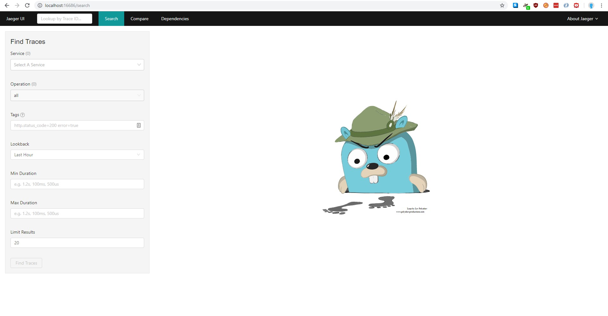

The second one is the »Dependencies« tab, which displays a graph of our microservices and their respective connections. 

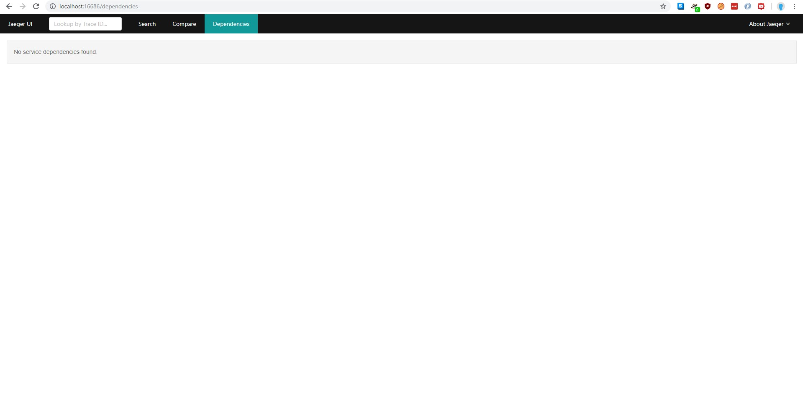

Right now, we have no data. Sample data can be added by exploring the GUI because Jaeger adds its own traces. 

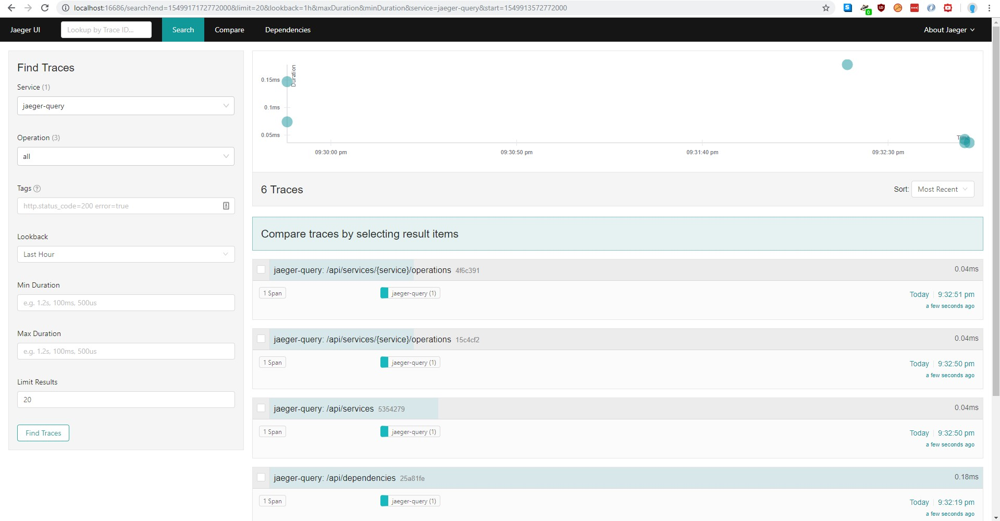

We can now open one trace.
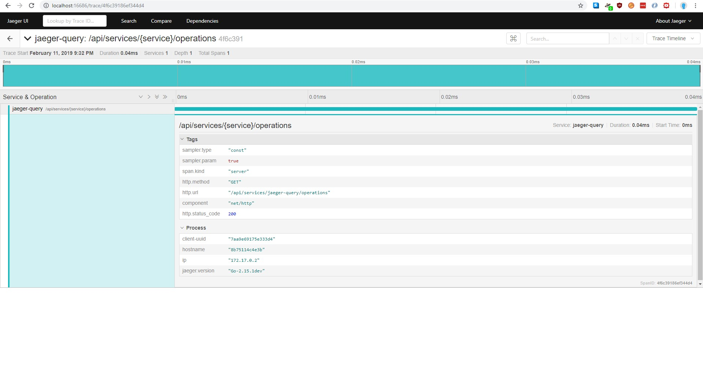

## Starting project structure
Before diving deeper, let us explain our starting project. 
Project consists of 5 microservices:
1. __master__ - This is the entry point of the application. It is served on `http://localhost:8080` (actual endpoint on `v1/master`). When queried, it makes two requests: to _alpha_ endpoint  `v1/alpha` and to _beta_ endpoint `v1/beta`.
2. __alpha__ - This is the first of 4 "slave" microservices. It is served on `http://localhost:8081` and has two endpoints: `/v1/alpha` (just returns value) and `/v1/alpha/beta`, which queries _gamma_ endpoint `v1/gamma`.
3. __beta__ - This is the second of 4 "slave" microservices. It is served on `http://localhost:8082` and has one endpoint: `/v1/beta`, which queries _alpha_ endpoint `/v1/alpha/beta`. Simulated lag is added to this request (random delay).
4. __gamma__ - This is the third of 4 "slave" microservices. It is served on `http://localhost:8083` and has one endpoint: `/v1/gamma`, which queries _delta_ endpoint `/v1/delta`. This microservice is different, because it uses a simulated database with CDI.
5. __delta__ - This is the last of 4 "slave" microservices. It is served on `http://localhost:8084` and has one endpoint: `/v1/delta`, which just return a value.


## Step by step commits
1. Adding KumuluzEE OpenTracing dependency (https://github.com/evader1337/opentracing-blog/commit/76f111771caed3160043cfab0521eba6c9451611)
2. Adding service-name property (https://github.com/evader1337/opentracing-blog/commit/6dfa5bb4bc523554c783d847916fb810cf38ae18)
3. Adding outgoing requests tracing (https://github.com/evader1337/opentracing-blog/commit/34ebb055afc71c56ee31258fbc3f448c9f9a21f0)
4. Adding data to spans (https://github.com/evader1337/opentracing-blog/commit/6b8d0f55a27f368b3d67470cbbeee348d623ed84)
5. Adding custom spans (https://github.com/evader1337/opentracing-blog/commit/0403a177b32a8596855bf6c1ded5fec4fad952e4)

## Adding KumuluzEE OpenTracing dependency
To start with tracing the first thing we need to do is add the dependency KumuluzEE OpenTracing to our application. Locate the file pom.xml in root folder and add the following dependency:
```
<dependency>
    <groupId>com.kumuluz.ee.opentracing</groupId>
    <artifactId>kumuluzee-opentracing-jaeger</artifactId>
    <version>${kumuluzee-opentracing.version}</version>
</dependency>
```

This needs to be done for all microservices. At the time of writing this blog the latest version of KumuluzEE OpenTracing was 1.0.0. 
Just by adding this dependency, tracing is automatically enabled on all JAX-RS incoming requests. To see how this looks inside Jaeger GUI, simply visit the master endpoint in your browser:
`http://localhost:8080/v1/master`. After the page loads, we can see if any traces were added to Jaeger. 

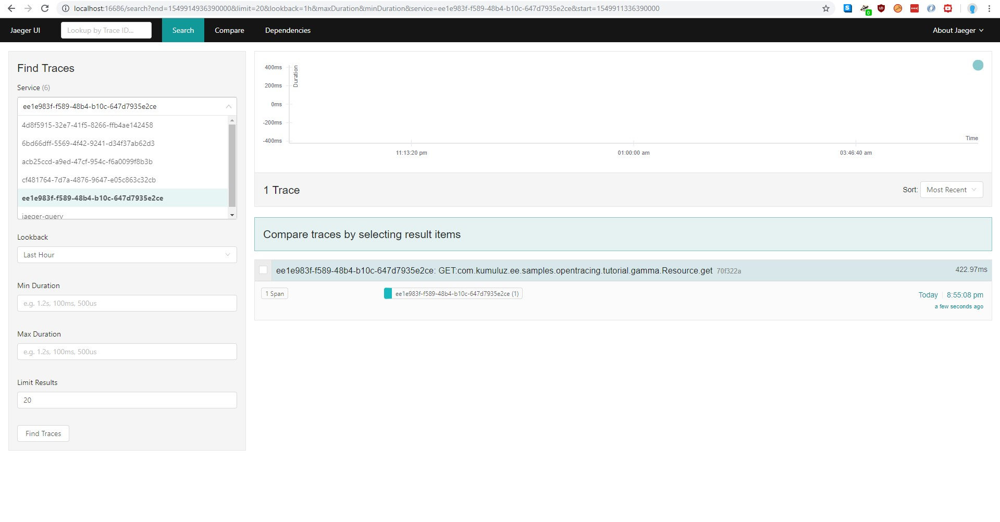

We can notice that there is a trace for each microservice with confusing names. That is not what we want, but it is a good first step.
The next step is to add the service name configuration field in order to make our traces more readable, since the default service name is Kumuluz instance id, which is just a bunch of numbers and letters (as seen in the image). We can do this in the `config.yml` file (located in `src/main/resources`) and add the service name field:

```
kumuluzee:
  opentracing:
    jaeger:
      service-name: master 
```

We can also add the property `kumuluzee.name`, which will be used as a service name if service name is not provided (service name is checked first, then `kumuluzee.name` and lastly the instance id). Remember, this needs to be done for all five microservices.
Let us rerun our microservices and try again. Traces are now more human friendly and better readable:

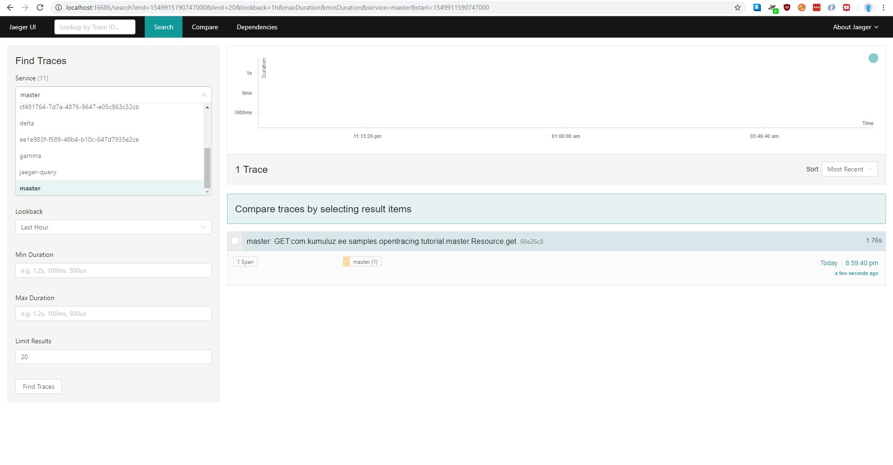

There are several other settings available, but we do not need them for this sample. For more information about other settings, check the KumuluzEE OpenTracing GitHub page (https://github.com/kumuluz/kumuluzee-opentracing). 

## Adding JAX-RS outgoing requests tracing
As already mentioned before, JAX-RS incoming requests are traced automatically. The same does not apply to outgoing requests. At the moment, we have traces for each individual microservice, but we want to see the whole trace grouped together. We need to add some code to achieve that. First, locate the `Resource.java` file (`src/main/java/com/dk/tracingblog/master`) and change the initialization logic for the `Client` class:
```java
private Client client = ClientTracingRegistrar.configure(ClientBuilder.newBuilder()).build();
```
For a microservice to resume the trace of some other microservice, the details of the trace need to be sent along with the REST request (achieved with HTTP headers). This is what a `ClientTracingRegistrar.configure` method does: it makes sure, that required headers are added to each outgoing request. After changing this line in all microservices (except `delta` microservice, which does not have a client), the result should be the following trace:

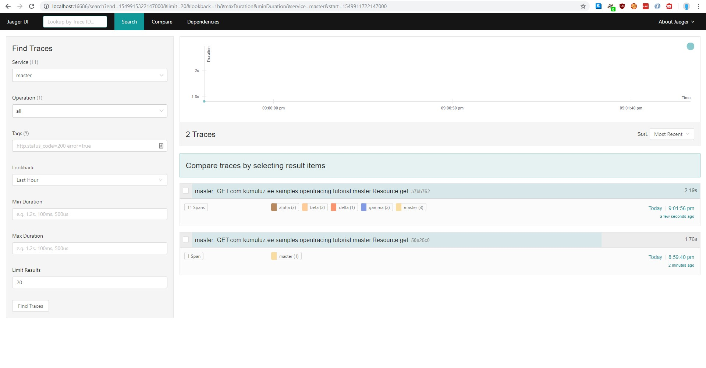

If we open this trace, we can see the whole request with all the microservices in one. 


This is exactly what we wanted; the overview of the whole request will all the timestamps. We can also look at the "Dependencies" tree now, which is updated with our microservices:

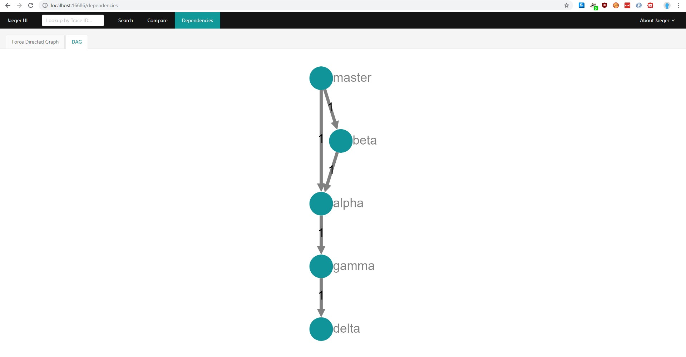


## Additional features
We will demonstrate three additional features of tracing:
-	Handling exceptions in spans,
-	Adding custom data to spans,
-	Adding custom spans (such as database access).

## Handling exceptions
Exceptions are handled automatically by the KumuluzEE OpenTracing. To demonstrate this, we will throw an exception in the `delta` microservice. Locate the `Resource.java` file (`src/main/java/com/dk/tracingblog/delta`) and add the following line:

```java
@GET
public Response get() {
    throw new RuntimeException("Something went wrong here.");
    // return Response.ok("delta").build();
}
```

We now have to restart the `delta` microservice and refresh the page. The created trace now looks like this:

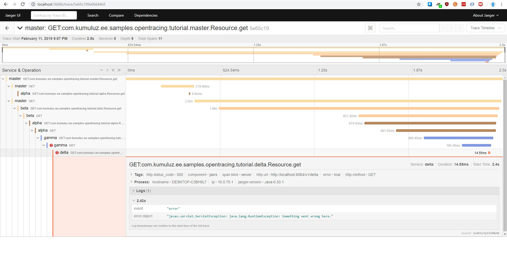

We can see from the trace that exception was added to the trace as a log. We will cover adding logs in the next section.

## Adding custom data to spans
If we look back to our project structure, we added some simulated lag to our application in the `beta` microservice. Basically, we added a random delay from 1 to 1000 milliseconds to the request. We will add this parameter to the trace to see, how much did we have to wait for the request. We start by moving the wait time to a new variable. Then we inject the `Tracer` instance. After that, we can access the current span with `tracer.activeSpan` and add our delay to it. We can do it in three ways: with adding a tag, adding a log entry or adding a baggage item. We will demonstrate all three:
-	`setTag();`
-	`log();`
-	`setBaggageItem();`

Full code:
```java
@Path("beta")
@Consumes(MediaType.APPLICATION_JSON)
@Produces(MediaType.APPLICATION_JSON)
@RequestScoped
public class Resource {
    private Client client = ClientTracingRegistrar.configure(ClientBuilder.newBuilder()).build();

    @Inject
    private Tracer tracer;

    @GET
    public Response get() {
        try {
            int waitDelay = ThreadLocalRandom.current().nextInt(1, 1000 + 1);
            tracer.activeSpan().setTag("waitDelay", waitDelay);
            tracer.activeSpan().log("Waited " + waitDelay + " milliseconds.");
            tracer.activeSpan().setBaggageItem("waitDelay", String.valueOf(waitDelay));
            Thread.sleep(waitDelay);
            Response r1 = client
                    .target("http://localhost:8081/v1")
                    .path("alpha")
                    .path("beta")
                    .request()
                    .get();
            String response = r1.readEntity(String.class);
            return Response.ok("beta->" + response).build();
        } catch (Exception e) {
            return Response.serverError().build();
        }
    }
}
```

Choosing a method of storing custom data is up to a developer. Tags are often used for storing metadata information (such as IP addresses, span types, versions, etc.), logs are used for storing messages (such as exceptions) and baggage is used for storing data, which can be retrieved later by developer with method `getBaggageItem()`.

This is not the only thing we can do with injected tracer. By injecting the tracer, you get access to its methods. The main thing you can do with it is start spans manually. You can read more in OpenTracing documentation (https://opentracing.io/docs/overview/). Also, read the documentation for more details on when to use each method of adding custom data to spans (baggage, log or tag). Let us restart the `beta` microservice and see how our trace looks like now:

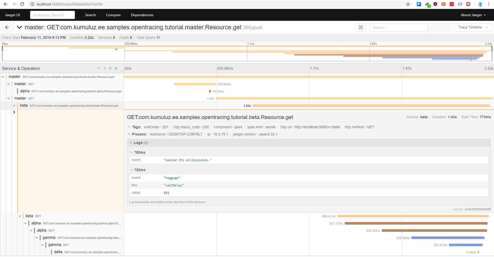

## Adding custom spans
The final thing we will do in this guide is add tracing to functions outside of JAX-RS. This way we can include methods and functions that are outside of a REST service to the distributed trace. Typical examples are calls to the database, calls to external applications using protocols other than REST services and similar scenarios.

To demonstrate this, we will show how to add calls to the database. We have implemented a simulated database in our `gamma` microservice. The easiest way to add custom spans is to use the `@Traced` annotation and put it on the class. This way, all the methods will be traced. This annotation can also be used on a single method if we want to trace only a specific method inside the class. It is also possible to annotate the class and then disable tracing on methods by annotating them and set property value to false. Annotating and setting value to false can also be used to disable automatic tracing of JAX-RS incoming requests.

We will put `@Traced` annotation to our Database class and all methods inside the class will be traced. It is also possible to change the span name by changing the operationName parameter. Let us see how this looks like inside the code (`Database.java` file, located in `src/main/java/com/dk/tracingblog/gamma`):

```java
@ApplicationScoped
@Traced(value = true, operationName = "testingChangedOperationName")
public class Database {
    private HashMap<Integer, String> data;

    @PostConstruct
    private void init() {
        data = new HashMap<Integer, String>();
        data.put(1, "gamma");
    }

    public String get(Integer id) {
        return data.get(id);
    }

}
```

As a result, we get the following span added to our trace:

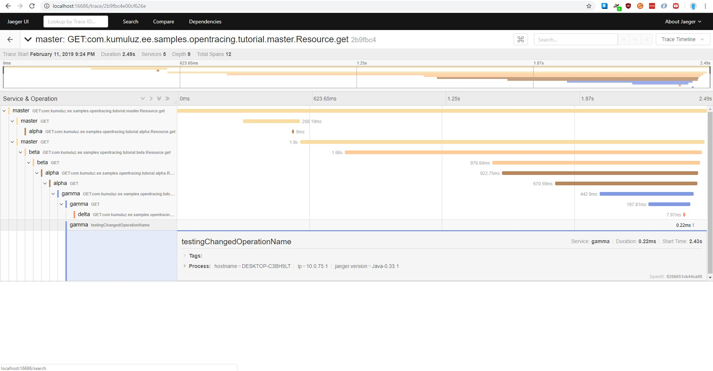


We could achieve the same thing by injecting a tracer and manually creating the span. This is used when a developer wants a more fine-grained control over created spans. That way, more that one span can be created inside one method.

## Summary
In this article, we have demonstrated the basic principles of distributed tracing for microservices. We implemented tracing of an existing application using the KumuluzEE OpenTracing extension. We did not need to write a lot of code. We only changed a few lines and added some annotations. This shows how simple it is to add distributed tracing to your existing microservices and get all the benefits of distributed tracing such as tracing requests through entire network of microservices and easier pinpointing of slowdowns.

Even though we covered basics of tracing, we left a few things out. For example, we did not include integration with MicroProfile Config extension and KumuluzEE config frameworks, which would allow additional tracing configuration such as ignoring tracing on JAX-RS endpoints and changing the way that spans are named. We have explained more advanced features only briefly but would suggest the reader to dig deeper into OpenTracing if they plan to use it in real-world applications. We also used the basic Jaeger configuration, ran all-in-one Jaeger and skipped most of the configuration. Running Jaeger as all-in-one is not recommended in production. For that reason, Jaeger components can be run separately (agent, collector, query and ingester). We did not cover any of the Jaeger specifics in the article, so we refer the reader to the Jaeger documentation for more in-depth guide on how to run Jaeger in production.

Thank you for reading and stay tuned for the second part, which will cover the Zipkin tracing.

## Useful links and references
For more information, visit the following links:
-	KumuluzEE (https://ee.kumuluz.com/ and https://github.com/kumuluz/)
-	KumuluzEE OpenTracing (https://github.com/kumuluz/kumuluzee-opentracing)
-	MicroProfile (https://microprofile.io/)
-	MicroProfile OpenTracing (https://github.com/eclipse/microprofile-opentracing)
-	Jaeger distributed tracing (https://www.jaegertracing.io/)
-	OpenTracing (https://opentracing.io/)
